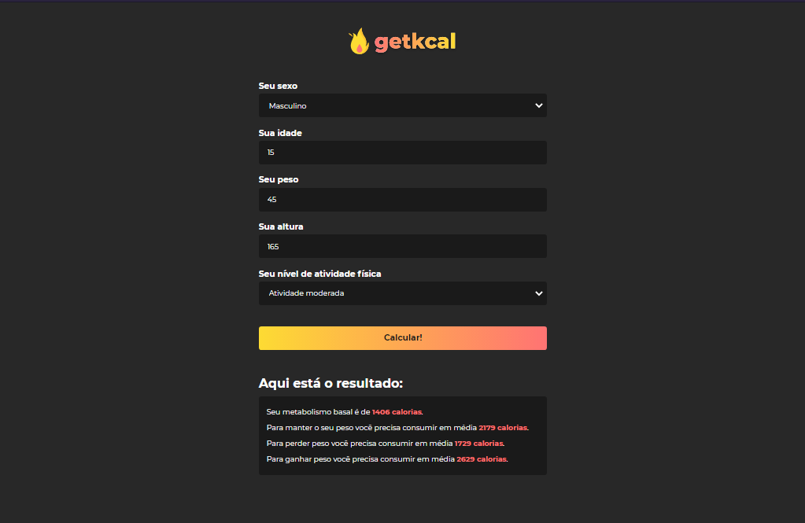

<h1 align="center">
  
</h1>

  <a href="#-tecnologias">Tecnologias</a>&nbsp;&nbsp;&nbsp;| &nbsp;&nbsp;&nbsp;
  <a href="#-projeto">Projeto</a>&nbsp;&nbsp;&nbsp;| &nbsp;&nbsp;&nbsp;
  <a href="#-como-começar">Como Começar</a>&nbsp;&nbsp;&nbsp;| &nbsp;&nbsp;&nbsp;
  <a href="#-como-contribuir">Como Contribuir</a>&nbsp;&nbsp;&nbsp;| &nbsp;&nbsp;&nbsp;
  <a href="#memo-licença">Licença</a>

 

  

  

## 🚀 Tecnologias

Esse projeto foi desenvolvido com as seguintes tecnologias:

- HTML, CSS e JavaScript

## 💻 Projeto

O getkal é uma app de calculadora de calorias de um determinado peso, gênero, altura, atividade física

## 🔥 Como Começar

Primeiro você precisa ter o [Git](https://git-scm.com) e o [Node.js](https://nodejs.org/en) instalado na suá máquina

- 1 - Faça um clone desse repositório `git clone https://github.com/pedroduarte2005/getkal.git`;
- 2 - Entre na pasta `cd getkal`;
- 3 - Rode `yarn init -y` ou `npm init -y` para iniciar o node no seu projeto;
- 5 - Instale o serve como dependência de desenvolimento com esse comando: `yarn add serve -D` ou `npm install server -D`;
- 6 - Rode `yarn serve .` ou `npx serve .` para rodar o projeto.

## ⚡️ Como contribuir

- Faça um fork desse repositório;
- Cria uma branch com a sua feature: `git checkout -b minha-feature`;
- Faça commit das suas alterações: `git commit -m 'feat: Minha nova feature'`;
- Faça push para a sua branch: `git push origin minha-feature`.

Depois que o merge da sua pull request for feito, você pode deletar a sua branch.

## :memo: Licença

Esse projeto está sob a licença MIT. Veja o arquivo [LICENSE](LICENSE.md) para mais detalhes.

---

Feito com ♥ by Pedro Duarte :wave:
